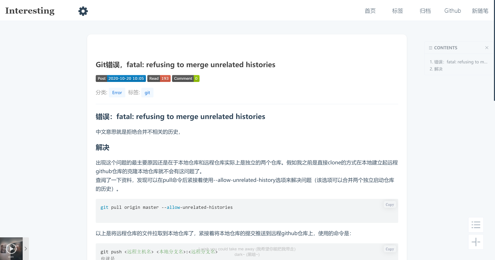

# 介绍

本主题改版自 https://github.com/YJLAugus/cnblogs-theme-simple-color

### ①功能简介

* 移动端适配
* 极简白，夜间黑，清新透明，玻璃磨砂 四种主题模式自动切换
* 音乐播放器
* 文章自动目录生成

### ②主题预览



[案例预览](https://www.cnblogs.com/xu-ux/p/12693839.html)


## 主题部署


### 1.基本设置


### 2.页面定制CSS

把`interesting.css`中的代码粘贴在自定义css样式中。


### 3. 博客侧边栏公告

```html

<!-- 头像 -->
<!--  <div class="av"> -->
<!--  
</div>  -->

<!-- 头像start -->
<script>
$(document).ready(function(){
   document.getElementById("favicon").setAttribute("href","https://blog-static.cnblogs.com/files/xu-ux/favicon.ico");

});
</script>
<!-- 头像end -->


<!--内容区start-->
<script type="text/javascript">
    $.silence({
        profile: {
            enable: true,
            avatar: 'https://images.cnblogs.com/cnblogs_com/xu-ux/1864779/o_2010160949432020.jpg',
            favicon: 'https://blog-static.cnblogs.com/files/xu-ux/favicon.ico',
        },
        catalog: {
            enable: true,
            move: true,
            index: true,
            level1: 'h2',
            level2: 'h3',
            level3: 'h4',
        },
        signature: {
            enable: true,
            home: 'https://xu-ux.cnblogs.com/',
            license: 'CC BY 4.0',
            link: 'https://creativecommons.org/licenses/by/4.0'
        },
       reward: {
            enable: false,
            title: '『一键投喂 软糖/蛋糕/布丁/牛奶/冰阔乐！』',
            <!--使用前记得换支付码-->
            wechat: 'https://www.cnblogs.com/images/cnblogs_com/yjlblog/1280680/o_wx_zfx.png',
            <!--使用前记得换支付码-->
            alipay: 'https://www.cnblogs.com/images/cnblogs_com/yjlblog/1280680/o_zfb_zfx.png',
        },     
        github: {
            enable: false,
            color: '#fff',
            fill: null,
            link: 'https://github.com/xu_uxo/'
        }
    });
</script>
<!--内容区end-->

<!--主题切换 放在侧边栏start-->
<script>
	$('.fa.fa-cog.fa-spin.fa-lg').click(function () {
	    $(this).closest('.float-btn-group').toggleClass('open');
	});
</script>
<!--主题切换 放在侧边栏end-->
<!--主题切换放在侧边栏start-->
<script>

function switchNightMode(){
    var night = document.cookie.replace(/(?:(?:^|.*;\s*)night\s*\=\s*([^;]*).*$)|^.*$/, "$1") || '0';
    if(night == '0'){
        document.body.classList.add('night');
        document.cookie = "night=1;path=/"
        console.log('夜间模式开启');
    }else{
        document.body.classList.remove('night');
        document.cookie = "night=0;path=/"
        console.log('夜间模式关闭');
    }
}

(function(){
    if(document.cookie.replace(/(?:(?:^|.*;\s*)night\s*\=\s*([^;]*).*$)|^.*$/, "$1") === ''){
        if(new Date().getHours() > 22 || new Date().getHours() < 6){
            document.body.classList.add('night');
            document.cookie = "night=1;path=/";
            console.log('夜间模式开启');
        }else{
            document.body.classList.remove('night');
            document.cookie = "night=0;path=/";
            console.log('夜间模式关闭');
        }
    }else{
        var night = document.cookie.replace(/(?:(?:^|.*;\s*)night\s*\=\s*([^;]*).*$)|^.*$/, "$1") || '0';
        if(night == '0'){
            document.body.classList.remove('night');
        }else if(night == '1'){
            document.body.classList.add('night');
        }
    }
})();

</script>

<script>

function switchModelMode(){
    var model = document.cookie.replace(/(?:(?:^|.*;\s*)model\s*\=\s*([^;]*).*$)|^.*$/, "$1") || '0';
    if(model == '0'){
        document.body.classList.add('model');
        document.cookie = "model=1;path=/"
        console.log('皮肤模式开启');
    }else{
        document.body.classList.remove('model');
        document.cookie = "model=0;path=/"
        console.log('皮肤模式关闭');
    }
}


function switchModelErcyMode(){
    var modelercy = document.cookie.replace(/(?:(?:^|.*;\s*)modelercy\s*\=\s*([^;]*).*$)|^.*$/, "$1") || '0';
    if(modelercy == '0'){
        document.body.classList.add('modelercy');
        document.cookie = "modelercy=1;path=/"
        console.log('皮肤模式开启');
    }else{
        document.body.classList.remove('modelercy');
        document.cookie = "modelercy=0;path=/"
        console.log('皮肤模式关闭');
    }
}

(function(){
    
        var modelercy = document.cookie.replace(/(?:(?:^|.*;\s*)modelercy\s*\=\s*([^;]*).*$)|^.*$/, "$1") || '0';
        if(modelercy == '0'){
            document.body.classList.remove('modelercy');
        }else if(modelercy == '1'){
            document.body.classList.add('modelercy');
        }
    
})();

(function(){
    var model = document.cookie.replace(/(?:(?:^|.*;\s*)model\s*\=\s*([^;]*).*$)|^.*$/, "$1") || '0';
        if(model == '0'){
            document.body.classList.remove('model');
        }else if(model == '1'){
            document.body.classList.add('model');
        }
  
})();
</script>
<!--主题切换放在侧边栏end-->


<!-- 头像 -->
<!-- 头像搞怪音乐 -->
<script>
    $(document).ready(function() {
        var voice = document.getElementById('voice'); //获取到audio元素
          $('.but').click(function() { //点击文字事件
            if (voice.paused) { //判断音乐是否在播放中，暂停状态
                voice.play(); //音乐播放
                $('.but').text('暂停'); //切换文字
                 
            } else { //播放状态
                voice.pause(); //音乐停止
                $('.but').text('播放'); //切换文字
            }
        });
     });
</script>
<!-- 头像搞怪音乐 -->

<!--随笔发布信息-->
<script>
if ($("#topics")!=null){
    $("#cnblogs_post_body").before("<p class='publishinfo'>"+

    "" +

    "<br/>" +
     $("#BlogPostCategory").html() + $("#EntryTag").html() +"</p>")
}
</script>

<!--首页排版调整-->
<script>
    for(i=0;i<=$(".desc_img").length;i++){
    	$(".desc_img").eq(i).insertBefore($(".postTitle").eq(i));
    	$(".postDesc").eq(i).insertAfter($(".day .postTitle").eq(i));
    }
    for(i=0;i<=$(".entrylistPostSummary").length;i++){
    	$(".desc_img").eq(i).insertBefore($(".entrylistPosttitle").eq(i));
    	$(".entrylistItemPostDesc").eq(i).insertAfter($(".entrylistPosttitle").eq(i));
    }
</script>


<!-- 鼠标点击特效 -->
<script src="https://blog-static.cnblogs.com/files/xu-ux/cursor-effects.js"></script>
<!-- 鼠标点击特效end -->

<!-- 随机打字机js-->
<script src="https://blog-static.cnblogs.com/files/xu-ux/roll.js"></script>
<!-- 随机打字机js end-->

```

  配置参数说明表：

| 模块                     | 属性             | 说明     | 类型                                                | 默认值 |
| ------------------------ | ---------------- | -------- | --------------------------------------------------- | ------ |
| base（基础信息）         | avatar           | 博主头像 | String                                              | null   |
| favicon                  | 网页标题图标     | String   | null                                                |        |
| catalog（博文目录）      | enable           | 是否启用 | Boolean                                             | false  |
| move                     | 是否允许拖拽     | Boolean  | true                                                |        |
| index                    | 是否显示索引     | Boolean  | true                                                |        |
| level1                   | 一级标题         | String   | h2                                                  |        |
| level2                   | 二级标题         | String   | h3                                                  |        |
| level3                   | 三级标题         | String   | h4                                                  |        |
| signature（博文签名）    | enable           | 是否启用 | Boolean                                             | false  |
| auther                   | 作者名字         | String   | [Blog Nickname]                                     |        |
| home                     | 作者主页         | String   | [https://www.cnblogs.com](https://www.cnblogs.com/) |        |
| license                  | 许可证名称       | String   | CC BY 4.0                                           |        |
| link                     | 许可证链接       | String   | https://creativecommons.org/licenses/by/4.0         |        |
| sponsor（博文赞赏）      | enable           | 是否启用 | Boolean                                             | false  |
| text                     | 标题             | String   | Sponsor                                             |        |
| paypal                   | PayPal 收款地址  | String   | null                                                |        |
| alipay                   | 支付宝收款二维码 | String   | null                                                |        |
| wechat                   | 微信收款二维码   | String   | null                                                |        |
| github（GitHub Corners） | enable           | 是否启用 | Boolean                                             | false  |
| fill                     | 背景填充色       | String   | [Silence Theme Color]                               |        |
| color                    | 章鱼猫颜色       | String   | #fff                                                |        |
| link                     | Github 链接      | String   | null                                                |        |

  配置完成后，记得点击「保存」按钮，保存上述操作。


### 4.页首html

```html
<!-- 主题切换按钮样式 放在页首 -->
<link rel="stylesheet" type="text/css" href="https://blog-static.cnblogs.com/files/xu-ux/themebtn.css">
<link rel="stylesheet" href="https://cdn.jsdelivr.net/npm/font-awesome/css/font-awesome.min.css"/>

<!-- 音乐播放器  放在页首 -->
<link rel="stylesheet" href="https://cdn.jsdelivr.net/npm/aplayer@1.10.0/dist/APlayer.min.css">
<link rel="stylesheet" href="https://blog-static.cnblogs.com/files/xu-ux/DPlayer.min.css">
<div id="aplayer" class="aplayer"  data-id="865331941" data-server="netease" data-type="playlist" data-fixed="true" data-listfolded="true" data-order="random" data-theme="#2D8CF0"></div>
<!-- 音乐播放器end -->

<!-- 图片灯箱 放在页首-->
<link rel="stylesheet" href="https://blog-static.cnblogs.com/files/xu-ux/zoom.css">
<!-- 图片灯箱 end-->

<!-- 自定义css-->
<link rel="stylesheet" href="https://blog-static.cnblogs.com/files/xu-ux/xuux-custom.css">
```


### 4.页脚html

```html
<!-- 核心引入 -->
<script src="https://blog-static.cnblogs.com/files/xu-ux/interesting.js"></script>

<!--主题切换放在页脚start-->
<section class="model-3"> 		  
<div class="float-btn-group"> 		     
	<i class="fa fa-cog fa-spin fa-lg "></i> 				
	<div class="btn-list"> 	
		<a href="javascript:void(0);" onclick="switchNightMode()" class="btn-float yellow"><i class="fa fa-moon-o"></i></a> 
		<a href="javascript:void(0);" onclick="switchModelMode()" class="btn-float blue"><i class="fa fa-heart-o"> </i></a>
		<a href="javascript:void(0);" onclick="switchModelErcyMode()"class="btn-float green"><i class="fa fa-heart"></i></a>
		<a href="https://i.cnblogs.com/" class="btn-float pink"><i class="fa fa-user"></i></a>
	</div>
</div>
</section >
<!--主题切换放在页脚end-->


<!-- 音乐播放器js 放在页脚 -->
<script src="https://blog-static.cnblogs.com/files/xu-ux/APlayer.min.js"></script>
<script src="https://blog-static.cnblogs.com/files/xu-ux/Meting.min.js"></script>
<!-- 音乐播放器js end -->

<!-- 图片灯箱js 放在页脚-->
<script src="https://blog-static.cnblogs.com/files/xu-ux/zoom.js"></script>
<!-- 图片灯箱js end-->

```

#### 图片灯箱

只需要在`img`标签中 写入 `data-action="zoom"`属性即可。

```

```

### 主题文章预览图设置


### 头部菜单设置

把下面链接中的地址换成你自己的`文章`或者`随笔`的地址就好。下面函数在`interesting.js`文件中。

```javascript
function() {
                var e = this,
                t = p(this.cnblogs.blogTitle).find("h1 a").html(),
                a = p(this.cnblogs.publicProfile).find("a:eq(0)").html(),
                o = p("head").find("title");
                //o.html(o.html().replace(a + " - 博客园", "" + t));
                var n = p(this.cnblogs.navList);
				n.find("li").eq(1).after('<li><a id="blog_nav_tags" class="menu" href="https://www.cnblogs.com/' + currentBlogApp + '/tag">标签</a></li>'),
				n.find("li").eq(2).after('<li><a id="blog_nav_tags" class="menu" href="https://www.cnblogs.com/yjlaugus/p/7705340.html ">关于</a></li>'),
				n.find("li").eq(3).after('<li><a id="blog_nav_tags" class="menu" href="https://www.cnblogs.com/yjlaugus/articles/weibo.html">微语</a></li>'),
				n.find("li").eq(4).after('<li><a id="blog_nav_tags" class="menu" href="https://www.cnblogs.com/yjlaugus/p/7857317.html ">投喂</a></li>'),
				n.find("li").eq(5).after('<li><a id="blog_nav_tags" class="menu" href="https://www.cnblogs.com/yjlaugus/p/8724650.html">友链</a></li>'),
                p.each(n.find("li"),
                function(e, t) {
                    p(t).append("<i></i>")
                }),
                p("body").prepend('<div class="esa-mobile-menu"></div>'),
                p(".esa-mobile-menu").on("click",
                function() {
                    p(e.cnblogs.navigator).fadeToggle(200)
                })
            }

```

